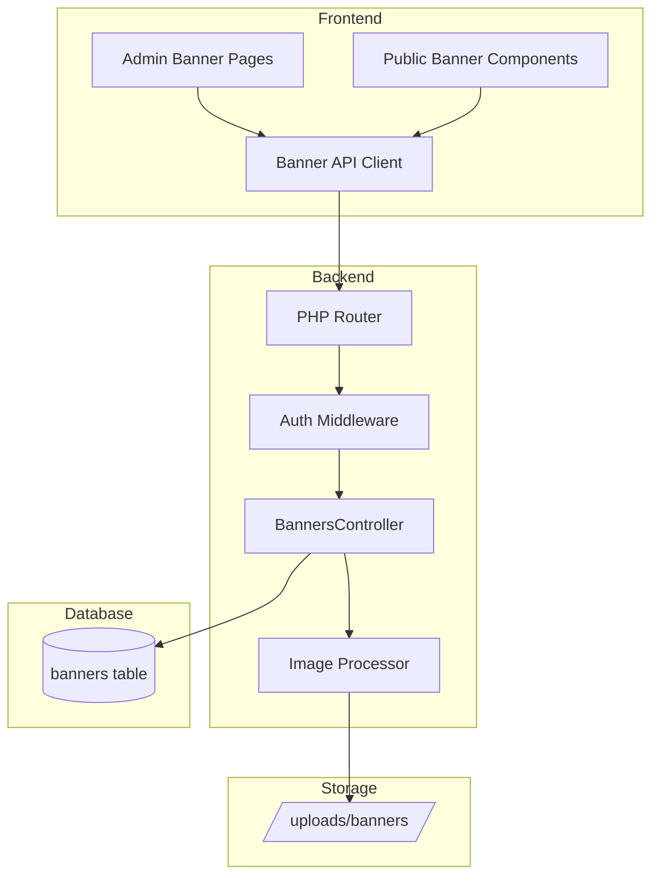
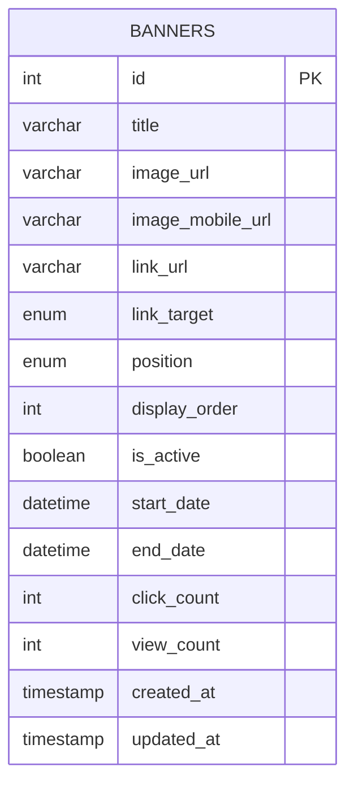

# Design Document: Banner Management System

## Overview

نظام إدارة البانرات الإعلانية لمعرض السيارات. يتيح للمدير إنشاء وإدارة البانرات الإعلانية مع دعم الجدولة الزمنية، مواقع الظهور المتعددة، والإحصائيات.

### Key Features
- إدارة كاملة للبانرات (CRUD)
- 7 مواقع ظهور مختلفة
- جدولة زمنية (تاريخ بداية ونهاية)
- دعم صور الموبايل المنفصلة
- تتبع الإحصائيات (مشاهدات ونقرات)
- ترتيب البانرات في نفس الموقع

## Architecture



## Components and Interfaces

### Backend Components

#### 1. BannersController (PHP)

```php
class BannersController {
    // Get all banners (admin)
    public function getAll(): array;
    
    // Get active banners for a position (public)
    public function getByPosition(string $position): array;
    
    // Get single banner
    public function getById(int $id): ?array;
    
    // Create new banner
    public function create(): array;
    
    // Update banner
    public function update(int $id): array;
    
    // Delete banner
    public function delete(int $id): void;
    
    // Toggle active status
    public function toggleActive(int $id): array;
    
    // Track click
    public function trackClick(int $id): void;
    
    // Track view
    public function trackView(int $id): void;
}
```

#### 2. API Endpoints

| Method | Endpoint | Auth | Description |
|--------|----------|------|-------------|
| GET | /banners | No | Get all banners (admin) or active banners (public) |
| GET | /banners/position/:position | No | Get active banners for position |
| GET | /banners/:id | No | Get single banner |
| POST | /banners | Yes | Create new banner |
| PUT | /banners/:id | Yes | Update banner |
| DELETE | /banners/:id | Yes | Delete banner |
| PUT | /banners/:id/toggle | Yes | Toggle active status |
| POST | /banners/:id/click | No | Track click |
| POST | /banners/:id/view | No | Track view |

### Frontend Components

#### 1. Admin Components

```typescript
// Banner list page
BannerListPage: React.FC
  - Displays all banners in a table
  - Filter by position and status
  - Actions: edit, delete, toggle active

// Banner form (create/edit)
BannerForm: React.FC<{ banner?: Banner }>
  - Image upload with preview
  - Mobile image upload (optional)
  - Position selector
  - Schedule date pickers
  - Link URL input

// Banner preview
BannerPreview: React.FC<{ banner: Banner }>
  - Shows how banner will appear
```

#### 2. Public Components

```typescript
// Banner display component
BannerDisplay: React.FC<{
  position: BannerPosition;
  className?: string;
}>
  - Fetches and displays banners for position
  - Handles click tracking
  - Responsive image display

// Banner popup
BannerPopup: React.FC
  - Shows popup banner on page load
  - Respects session storage to avoid repeat
```

### TypeScript Interfaces

```typescript
// Banner positions
type BannerPosition = 
  | 'hero_top' 
  | 'hero_bottom' 
  | 'sidebar' 
  | 'cars_between' 
  | 'car_detail' 
  | 'footer_above' 
  | 'popup';

// Link target
type LinkTarget = '_self' | '_blank';

// Banner interface
interface Banner {
  id: number;
  title: string;
  imageUrl: string;
  imageMobileUrl: string | null;
  linkUrl: string | null;
  linkTarget: LinkTarget;
  position: BannerPosition;
  displayOrder: number;
  isActive: boolean;
  startDate: string | null;
  endDate: string | null;
  clickCount: number;
  viewCount: number;
  createdAt: string;
  updatedAt: string;
}

// Create banner input
interface CreateBannerInput {
  title: string;
  image: File;
  imageMobile?: File;
  linkUrl?: string;
  linkTarget?: LinkTarget;
  position: BannerPosition;
  displayOrder?: number;
  isActive?: boolean;
  startDate?: string;
  endDate?: string;
}

// Update banner input
interface UpdateBannerInput {
  title?: string;
  image?: File;
  imageMobile?: File;
  linkUrl?: string;
  linkTarget?: LinkTarget;
  position?: BannerPosition;
  displayOrder?: number;
  isActive?: boolean;
  startDate?: string;
  endDate?: string;
}

// Banner filters
interface BannerFilters {
  position?: BannerPosition;
  isActive?: boolean;
}
```

## Data Models

### Database Schema

```sql
CREATE TABLE IF NOT EXISTS banners (
    id INT AUTO_INCREMENT PRIMARY KEY,
    title VARCHAR(100) NOT NULL,
    image_url VARCHAR(500) NOT NULL,
    image_mobile_url VARCHAR(500) NULL,
    link_url VARCHAR(500) NULL,
    link_target ENUM('_self', '_blank') DEFAULT '_blank',
    position ENUM('hero_top', 'hero_bottom', 'sidebar', 'cars_between', 'car_detail', 'footer_above', 'popup') NOT NULL,
    display_order INT DEFAULT 0,
    is_active TINYINT(1) DEFAULT 1,
    start_date DATETIME NULL,
    end_date DATETIME NULL,
    click_count INT DEFAULT 0,
    view_count INT DEFAULT 0,
    created_at TIMESTAMP DEFAULT CURRENT_TIMESTAMP,
    updated_at TIMESTAMP DEFAULT CURRENT_TIMESTAMP ON UPDATE CURRENT_TIMESTAMP,
    
    INDEX idx_position (position),
    INDEX idx_is_active (is_active),
    INDEX idx_display_order (display_order),
    INDEX idx_schedule (start_date, end_date),
    INDEX idx_position_active (position, is_active)
) ENGINE=InnoDB DEFAULT CHARSET=utf8mb4 COLLATE=utf8mb4_unicode_ci;
```

### Entity Relationship




## Correctness Properties

*A property is a characteristic or behavior that should hold true across all valid executions of a system—essentially, a formal statement about what the system should do. Properties serve as the bridge between human-readable specifications and machine-verifiable correctness guarantees.*

### Property 1: Banner CRUD Round-Trip

*For any* valid banner data, creating a banner then retrieving it by ID should return equivalent data (title, position, linkUrl, isActive, schedule dates match the input).

**Validates: Requirements 1.5, 2.2**

### Property 2: Required Field Validation

*For any* banner creation request missing title, image, or position, the system should reject the request with a validation error.

**Validates: Requirements 1.2**

### Property 3: Position Validation

*For any* string that is not one of the 7 valid positions (hero_top, hero_bottom, sidebar, cars_between, car_detail, footer_above, popup), the system should reject the banner creation/update request.

**Validates: Requirements 1.4**

### Property 4: URL Format Validation

*For any* string provided as linkUrl that is not a valid URL format, the system should reject the request with a validation error.

**Validates: Requirements 1.3**

### Property 5: Image Format Validation

*For any* uploaded file that is not JPG, PNG, or WebP format, or exceeds 5MB, the system should reject the upload.

**Validates: Requirements 1.1**

### Property 6: Schedule Date Validation

*For any* banner where start_date is after end_date, the system should reject the creation/update request with a validation error.

**Validates: Requirements 6.4**

### Property 7: Banner Visibility Rules

*For any* banner query by position, the returned banners should satisfy ALL of the following conditions:
- is_active is true
- start_date is null OR start_date <= current time
- end_date is null OR end_date >= current time

**Validates: Requirements 5.2, 6.1, 6.2, 6.3, 8.2**

### Property 8: Position Filtering

*For any* position filter applied to banner list, all returned banners should have that exact position value.

**Validates: Requirements 4.3**

### Property 9: Status Filtering

*For any* status filter (active/inactive) applied to banner list, all returned banners should have matching is_active value.

**Validates: Requirements 4.4**

### Property 10: Display Ordering

*For any* list of banners in the same position, they should be ordered by display_order in ascending order (lower values first).

**Validates: Requirements 7.1, 7.3**

### Property 11: Toggle Status Idempotence

*For any* banner, toggling its status twice should return it to its original is_active state.

**Validates: Requirements 5.1**

### Property 12: View Count Increment

*For any* banner, calling trackView should increment view_count by exactly 1.

**Validates: Requirements 8.3**

### Property 13: Click Count Increment

*For any* banner, calling trackClick should increment click_count by exactly 1.

**Validates: Requirements 8.4**

### Property 14: Response Format Completeness

*For any* banner returned from the API, it should contain all required fields: id, title, imageUrl, position, isActive, startDate, endDate, clickCount, viewCount.

**Validates: Requirements 4.2**

### Property 15: Banner Deletion Removes Record

*For any* banner that is deleted, subsequent retrieval by ID should return 404 not found.

**Validates: Requirements 3.1**

## Error Handling

### Backend Error Codes

| Code | HTTP Status | Description |
|------|-------------|-------------|
| BNR_001 | 400 | Invalid image format (not JPG/PNG/WebP) |
| BNR_002 | 400 | Image size exceeds 5MB |
| BNR_003 | 400 | Missing required field (title/image/position) |
| BNR_004 | 400 | Invalid position value |
| BNR_005 | 400 | Invalid URL format |
| BNR_006 | 400 | Invalid schedule (start_date after end_date) |
| BNR_007 | 404 | Banner not found |
| AUTH_001 | 401 | Unauthorized (missing/invalid token) |
| SRV_001 | 500 | Internal server error |

### Error Response Format

```json
{
  "success": false,
  "error": {
    "code": "BNR_001",
    "message": "صيغة الصورة غير مدعومة. الصيغ المدعومة: JPG, PNG, WebP"
  }
}
```

### Frontend Error Handling

```typescript
// Error handling in API client
try {
  await api.createBanner(data);
} catch (error) {
  if (error.code === 'BNR_001') {
    toast.error('صيغة الصورة غير مدعومة');
  } else if (error.code === 'BNR_003') {
    toast.error('يرجى ملء جميع الحقول المطلوبة');
  } else {
    toast.error('حدث خطأ غير متوقع');
  }
}
```

## Testing Strategy

### Dual Testing Approach

This system will be tested using both unit tests and property-based tests:

1. **Unit Tests**: Verify specific examples, edge cases, and error conditions
2. **Property-Based Tests**: Verify universal properties across all valid inputs

### Property-Based Testing Configuration

- **Library**: PHPUnit with eris/eris for PHP backend, fast-check for TypeScript frontend
- **Minimum iterations**: 100 per property test
- **Tag format**: `Feature: banner-management, Property {number}: {property_text}`

### Test Categories

#### Backend Tests (PHP)

1. **BannersController Unit Tests**
   - Test CRUD operations with specific examples
   - Test error handling for invalid inputs
   - Test authentication requirements

2. **BannersController Property Tests**
   - Property 1: CRUD round-trip
   - Property 2: Required field validation
   - Property 3: Position validation
   - Property 4: URL validation
   - Property 6: Schedule validation
   - Property 7: Visibility rules
   - Property 8: Position filtering
   - Property 9: Status filtering
   - Property 10: Display ordering
   - Property 11: Toggle idempotence
   - Property 12: View count increment
   - Property 13: Click count increment
   - Property 14: Response format
   - Property 15: Deletion removes record

#### Frontend Tests (TypeScript)

1. **Component Unit Tests**
   - BannerForm validation
   - BannerDisplay rendering
   - BannerPopup behavior

2. **API Client Property Tests**
   - Property 5: Image format validation (client-side)
   - Response parsing correctness

### Test File Structure

```
api/tests/
├── Property/
│   └── BannerPropertyTest.php
└── Unit/
    └── BannersControllerTest.php

frontend/src/__tests__/
├── properties/
│   └── banner.property.test.ts
└── unit/
    └── BannerForm.test.tsx
```
