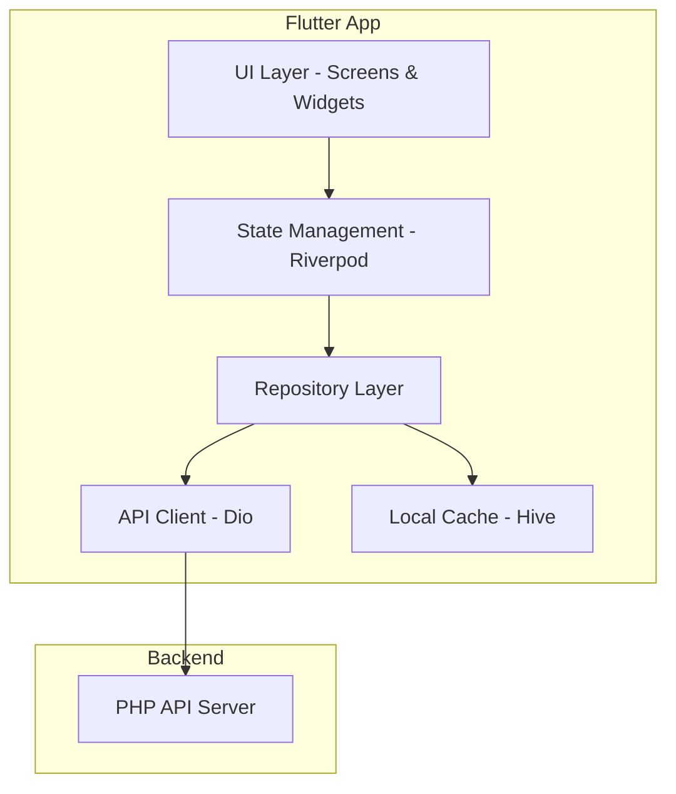

# Design Document: Flutter Customer App

## Overview

تطبيق Flutter للعملاء يتيح تصفح السيارات المتاحة في معرض السيارات. التطبيق متكامل مع الـ Backend API الموجود ويدعم اللغة العربية بشكل كامل.

### Key Features
- تصفح السيارات مع البحث والفلترة
- عرض تفاصيل السيارة مع معرض الصور والفيديو
- التواصل عبر واتساب والاتصال
- عرض البانرات الإعلانية
- دعم RTL والثيمات

## Architecture



## Project Structure

```
mobile/
├── lib/
│   ├── main.dart
│   ├── app.dart
│   ├── core/
│   │   ├── api/
│   │   │   ├── api_client.dart
│   │   │   ├── api_endpoints.dart
│   │   │   └── api_exceptions.dart
│   │   ├── constants/
│   │   │   ├── app_colors.dart
│   │   │   ├── app_strings.dart
│   │   │   └── app_theme.dart
│   │   └── utils/
│   │       ├── formatters.dart
│   │       └── url_launcher_utils.dart
│   ├── models/
│   │   ├── car.dart
│   │   ├── banner.dart
│   │   ├── settings.dart
│   │   └── car_filter.dart
│   ├── repositories/
│   │   ├── car_repository.dart
│   │   ├── banner_repository.dart
│   │   └── settings_repository.dart
│   ├── providers/
│   │   ├── car_provider.dart
│   │   ├── banner_provider.dart
│   │   └── settings_provider.dart
│   ├── screens/
│   │   ├── home/
│   │   │   └── home_screen.dart
│   │   ├── cars/
│   │   │   ├── cars_list_screen.dart
│   │   │   └── car_details_screen.dart
│   │   ├── brands/
│   │   │   └── brands_screen.dart
│   │   └── about/
│   │       └── about_screen.dart
│   └── widgets/
│       ├── car_card.dart
│       ├── car_filter_sheet.dart
│       ├── banner_carousel.dart
│       ├── image_gallery.dart
│       └── contact_buttons.dart
├── test/
│   ├── models/
│   ├── repositories/
│   └── widgets/
├── pubspec.yaml
└── analysis_options.yaml
```

## Components and Interfaces

### Data Models

```dart
// Car Model
class Car {
  final int id;
  final String name;
  final String brand;
  final String model;
  final int year;
  final double price;
  final String condition; // 'NEW' | 'USED'
  final String? origin;
  final int? kilometers;
  final String description;
  final String specifications;
  final String status; // 'AVAILABLE' | 'SOLD'
  final bool isFeatured;
  final int viewCount;
  final String? thumbnail;
  final String? bodyType;
  final DateTime createdAt;
  final DateTime updatedAt;
  final List<CarImage> images;
  final CarVideo? video;
  final CarInspection? inspection;
}

class CarImage {
  final int id;
  final int carId;
  final String url;
  final int order;
}

class CarVideo {
  final int id;
  final int carId;
  final String type; // 'YOUTUBE' | 'UPLOAD'
  final String url;
}

// Banner Model
class Banner {
  final int id;
  final String title;
  final String imageUrl;
  final String? imageMobileUrl;
  final String? linkUrl;
  final String linkTarget;
  final String position;
  final int displayOrder;
  final bool isActive;
  final DateTime? startDate;
  final DateTime? endDate;
  final int clickCount;
  final int viewCount;
}

// Settings Model
class ShowroomSettings {
  final String id;
  final String name;
  final String description;
  final String address;
  final String phone;
  final String whatsapp;
  final String workingHours;
  final double? mapLatitude;
  final double? mapLongitude;
}

// Car Filter Model
class CarFilter {
  final String? search;
  final String? brand;
  final String? condition;
  final double? minPrice;
  final double? maxPrice;
  final int? year;
  final String sortBy; // 'newest' | 'price_asc' | 'price_desc'
}
```

### API Client

```dart
class ApiClient {
  final Dio _dio;
  final String baseUrl;
  
  // Cars
  Future<List<Car>> getCars({CarFilter? filter});
  Future<Car> getCarById(int id);
  Future<List<String>> getBrands();
  Future<void> incrementViewCount(int carId);
  
  // Banners
  Future<List<Banner>> getBannersByPosition(String position);
  Future<void> trackBannerView(int bannerId);
  Future<void> trackBannerClick(int bannerId);
  
  // Settings
  Future<ShowroomSettings> getSettings();
}
```

### Repository Layer

```dart
abstract class CarRepository {
  Future<List<Car>> getCars({CarFilter? filter});
  Future<Car> getCarById(int id);
  Future<List<String>> getBrands();
  Future<List<Car>> getFeaturedCars();
  List<Car> filterCars(List<Car> cars, CarFilter filter);
}

abstract class BannerRepository {
  Future<List<Banner>> getActiveBanners(String position);
  Future<void> trackView(int bannerId);
  Future<void> trackClick(int bannerId);
}

abstract class SettingsRepository {
  Future<ShowroomSettings> getSettings();
}
```

### State Management (Riverpod)

```dart
// Car Providers
final carsProvider = FutureProvider.family<List<Car>, CarFilter?>((ref, filter) async {
  final repository = ref.watch(carRepositoryProvider);
  return repository.getCars(filter: filter);
});

final featuredCarsProvider = FutureProvider<List<Car>>((ref) async {
  final repository = ref.watch(carRepositoryProvider);
  return repository.getFeaturedCars();
});

final carDetailsProvider = FutureProvider.family<Car, int>((ref, id) async {
  final repository = ref.watch(carRepositoryProvider);
  return repository.getCarById(id);
});

final brandsProvider = FutureProvider<List<String>>((ref) async {
  final repository = ref.watch(carRepositoryProvider);
  return repository.getBrands();
});

// Banner Provider
final bannersProvider = FutureProvider.family<List<Banner>, String>((ref, position) async {
  final repository = ref.watch(bannerRepositoryProvider);
  return repository.getActiveBanners(position);
});

// Settings Provider
final settingsProvider = FutureProvider<ShowroomSettings>((ref) async {
  final repository = ref.watch(settingsRepositoryProvider);
  return repository.getSettings();
});
```

## Screens Design

### Home Screen
- Hero banner carousel (position: hero_top)
- Featured cars horizontal list
- Quick search bar
- Bottom navigation

### Cars List Screen
- Search bar with filter button
- Filter bottom sheet (brand, condition, price, year)
- Grid/List view of cars
- Pull-to-refresh

### Car Details Screen
- Image gallery with page indicator
- Car info section
- Video player (if available)
- Inspection viewer (for used cars)
- Contact buttons (WhatsApp, Call)
- Share button

### Brands Screen
- Grid of brands with car count
- Tap to filter cars by brand

### About Screen
- Showroom info
- Contact details
- Map link
- Working hours

## Data Models

### API Response Format

```json
{
  "success": true,
  "data": { ... }
}
```

### Error Response Format

```json
{
  "success": false,
  "error": {
    "code": "ERROR_CODE",
    "message": "Error message"
  }
}
```

## Correctness Properties

*A property is a characteristic or behavior that should hold true across all valid executions of a system—essentially, a formal statement about what the system should do. Properties serve as the bridge between human-readable specifications and machine-verifiable correctness guarantees.*

### Property 1: Car Data Completeness

*For any* car returned from the API, it should contain all required fields: id, name, brand, model, year, price, condition, and images array.

**Validates: Requirements 1.2, 3.3**

### Property 2: Filter Correctness

*For any* combination of filters (brand, condition, price range, year, search), all returned cars should satisfy ALL applied filter conditions (AND logic).

**Validates: Requirements 2.1, 2.2, 2.3, 2.4, 2.5, 2.6**

### Property 3: Filter Reset

*For any* filter state, clearing all filters should return the same cars as querying with no filters.

**Validates: Requirements 2.7**

### Property 4: Featured Cars Filter

*For any* list of cars, filtering for featured cars should return only cars where isFeatured is true.

**Validates: Requirements 7.1**

### Property 5: Banner Schedule Validation

*For any* banner with schedule dates, it should only be displayed when current time is within startDate and endDate (inclusive).

**Validates: Requirements 5.4**

### Property 6: WhatsApp URL Generation

*For any* car and showroom settings, the generated WhatsApp URL should contain the correct phone number and include car details in the message.

**Validates: Requirements 4.1, 4.3**

### Property 7: Phone URL Generation

*For any* showroom settings with a phone number, the generated phone URL should be in the format "tel:{phone}".

**Validates: Requirements 4.2, 4.3**

### Property 8: Currency Formatting

*For any* price value, the formatted string should be in Arabic format with YER currency.

**Validates: Requirements 8.3**

### Property 9: Brand Car Count

*For any* brand in the brands list, the car count should equal the number of available cars with that brand.

**Validates: Requirements 10.3**

### Property 10: Settings Data Completeness

*For any* settings response, it should contain name, description, address, phone, whatsapp, and workingHours.

**Validates: Requirements 6.1**

## Error Handling

### Network Errors
- Show "لا يوجد اتصال بالإنترنت" message
- Provide retry button
- Use cached data if available

### API Errors
- Parse error response and show appropriate message
- Log errors for debugging

### Empty States
- Cars list: "لا توجد سيارات متاحة حالياً"
- Search results: "لا توجد نتائج للبحث"
- Featured cars: Hide section

## Testing Strategy

### Dual Testing Approach

1. **Unit Tests**: Test individual functions and classes
2. **Property-Based Tests**: Test universal properties across all inputs

### Property-Based Testing Configuration

- **Library**: fast_check (Dart property-based testing library)
- **Minimum iterations**: 100 per property test
- **Tag format**: `Feature: flutter-customer-app, Property {number}: {property_text}`

### Test Categories

#### Model Tests
- JSON serialization/deserialization round-trip
- Data validation

#### Repository Tests
- Filter logic correctness
- API response parsing

#### Utility Tests
- URL generation
- Currency formatting
- Date formatting

### Test File Structure

```
test/
├── models/
│   ├── car_test.dart
│   └── banner_test.dart
├── repositories/
│   └── car_repository_test.dart
├── utils/
│   ├── formatters_test.dart
│   └── url_launcher_utils_test.dart
└── properties/
    ├── filter_property_test.dart
    ├── url_generation_property_test.dart
    └── formatting_property_test.dart
```

## Dependencies

```yaml
dependencies:
  flutter:
    sdk: flutter
  flutter_localizations:
    sdk: flutter
  
  # State Management
  flutter_riverpod: ^2.4.0
  
  # Networking
  dio: ^5.4.0
  
  # Local Storage
  hive: ^2.2.3
  hive_flutter: ^1.1.0
  
  # Image Caching
  cached_network_image: ^3.3.0
  
  # Video Player
  video_player: ^2.8.0
  youtube_player_flutter: ^8.1.2
  
  # URL Launcher
  url_launcher: ^6.2.0
  
  # UI Components
  carousel_slider: ^4.2.1
  shimmer: ^3.0.0
  
  # Utilities
  intl: ^0.18.0
  share_plus: ^7.2.0

dev_dependencies:
  flutter_test:
    sdk: flutter
  
  # Property-Based Testing
  fast_check: ^0.1.0
  
  # Code Generation
  build_runner: ^2.4.0
  hive_generator: ^2.0.1
  
  # Linting
  flutter_lints: ^3.0.0
```

