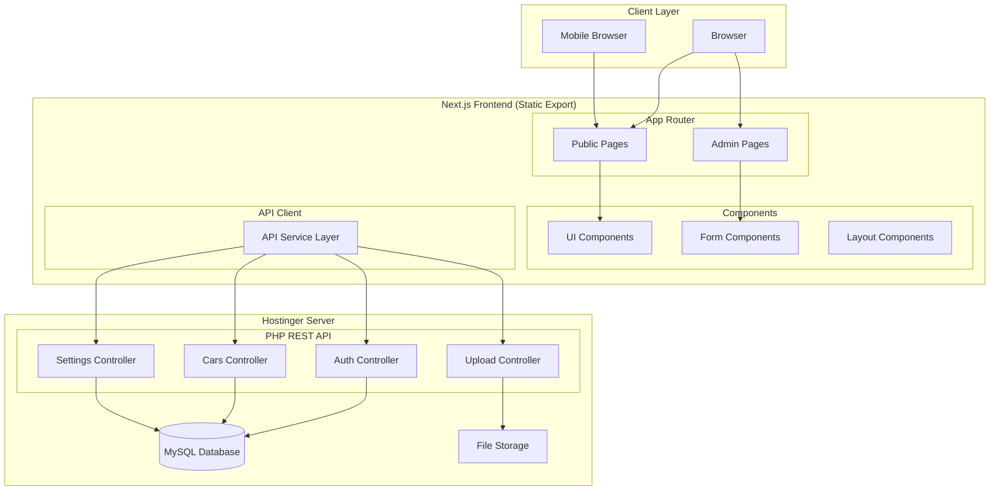

# Design Document: Yemen Car Showroom Platform

## Overview

منصة ويب متكاملة لمعرض وحدة اليمن للسيارات مبنية باستخدام Next.js 14 مع TypeScript للواجهة الأمامية، وPHP API للخلفية مع قاعدة بيانات MySQL على استضافة Hostinger. تستخدم المنصة App Router للتوجيه وTailwind CSS للتصميم المتجاوب.

### Technology Stack

| Layer | Technology |
|-------|------------|
| Frontend | Next.js 14, React 18, TypeScript |
| Styling | Tailwind CSS, Shadcn/ui |
| Backend API | PHP 8.x (REST API) |
| Database | MySQL (Hostinger) |
| Authentication | JWT (JSON Web Tokens) |
| File Storage | Hostinger File System |
| Image Processing | PHP GD Library / Imagick |
| Hosting | Hostinger (PHP + MySQL) |

### Deployment Architecture

```
Hostinger Server
├── public_html/
│   ├── api/              # PHP REST API
│   │   ├── config/       # Database config
│   │   ├── controllers/  # API controllers
│   │   ├── models/       # Data models
│   │   └── uploads/      # Uploaded files
│   └── frontend/         # Next.js static export
│       └── _next/        # Static assets
```

## Architecture



## Components and Interfaces

### Public Pages Structure

```
# Next.js Frontend Structure
app/
├── page.tsx                    # Homepage with featured cars
├── cars/
│   ├── page.tsx               # All cars listing with filters
│   └── [id]/
│       └── page.tsx           # Car details page
├── about/
│   └── page.tsx               # About showroom page
├── admin/
│   ├── login/
│   │   └── page.tsx           # Admin login
│   ├── dashboard/
│   │   └── page.tsx           # Statistics dashboard
│   ├── cars/
│   │   ├── page.tsx           # Car management list
│   │   ├── new/
│   │   │   └── page.tsx       # Add new car
│   │   └── [id]/
│   │       └── edit/
│   │           └── page.tsx   # Edit car
│   ├── archive/
│   │   └── page.tsx           # Archived cars
│   └── settings/
│       └── page.tsx           # Showroom settings
└── lib/
    └── api.ts                 # API client for PHP backend

# PHP Backend Structure (Hostinger)
api/
├── config/
│   ├── database.php           # MySQL connection
│   └── cors.php               # CORS headers
├── controllers/
│   ├── AuthController.php     # Login/logout
│   ├── CarsController.php     # Car CRUD operations
│   ├── ImagesController.php   # Image management
│   ├── VideosController.php   # Video management
│   ├── SettingsController.php # Showroom settings
│   └── StatsController.php    # Dashboard statistics
├── models/
│   ├── Car.php
│   ├── CarImage.php
│   ├── CarVideo.php
│   ├── User.php
│   └── Settings.php
├── middleware/
│   └── AuthMiddleware.php     # JWT verification
├── utils/
│   ├── ImageProcessor.php     # Image compression
│   └── Response.php           # JSON response helper
├── uploads/
│   ├── images/                # Car images
│   └── videos/                # Uploaded videos
├── index.php                  # API router
└── .htaccess                  # URL rewriting
```

### PHP API Endpoints

```
# Authentication
POST   /api/auth/login         # Admin login
POST   /api/auth/logout        # Admin logout
GET    /api/auth/verify        # Verify JWT token

# Cars
GET    /api/cars               # Get all cars (with filters)
GET    /api/cars/:id           # Get car by ID
POST   /api/cars               # Create new car
PUT    /api/cars/:id           # Update car
DELETE /api/cars/:id           # Delete car
POST   /api/cars/:id/duplicate # Duplicate car
PUT    /api/cars/:id/featured  # Toggle featured
PUT    /api/cars/:id/archive   # Archive car
PUT    /api/cars/:id/restore   # Restore car
PUT    /api/cars/:id/view      # Increment view count

# Car Images
GET    /api/cars/:id/images    # Get car images
POST   /api/cars/:id/images    # Upload images
PUT    /api/cars/:id/images/reorder  # Reorder images
DELETE /api/images/:id         # Delete image

# Car Videos
GET    /api/cars/:id/video     # Get car video
POST   /api/cars/:id/video     # Add video
DELETE /api/videos/:id         # Delete video

# Settings
GET    /api/settings           # Get showroom settings
PUT    /api/settings           # Update settings

# Statistics
GET    /api/stats              # Get dashboard stats

# Brands
GET    /api/brands             # Get all brands
```

### Core Interfaces

```typescript
// types/car.ts
interface Car {
  id: string;
  name: string;
  brand: string;
  model: string;
  year: number;
  price: number;
  condition: 'new' | 'used';
  kilometers?: number;
  description: string;
  specifications: string;
  status: 'available' | 'sold';
  isFeatured: boolean;
  viewCount: number;
  createdAt: Date;
  updatedAt: Date;
  images: CarImage[];
  video?: CarVideo;
}

interface CarImage {
  id: string;
  carId: string;
  url: string;
  order: number;
  createdAt: Date;
}

interface CarVideo {
  id: string;
  carId: string;
  type: 'youtube' | 'upload';
  url: string;
  createdAt: Date;
}

// types/settings.ts
interface ShowroomSettings {
  id: string;
  name: string;
  description: string;
  address: string;
  phone: string;
  whatsapp: string;
  workingHours: string;
  mapLatitude?: number;
  mapLongitude?: number;
  updatedAt: Date;
}

// types/user.ts
interface AdminUser {
  id: string;
  username: string;
  passwordHash: string;
  createdAt: Date;
  updatedAt: Date;
}

// types/filters.ts
interface CarFilters {
  search?: string;
  brand?: string;
  condition?: 'new' | 'used';
  minPrice?: number;
  maxPrice?: number;
  year?: number;
  sortBy?: 'newest' | 'price_asc' | 'price_desc';
}

// types/statistics.ts
interface DashboardStats {
  totalCars: number;
  availableCars: number;
  soldCars: number;
  totalViews: number;
  mostViewedCars: Car[];
}
```

### API Service Layer

```typescript
// lib/api.ts - Frontend API Client
const API_BASE_URL = process.env.NEXT_PUBLIC_API_URL || '/api';

interface ApiClient {
  // Auth
  login(username: string, password: string): Promise<{ token: string }>;
  logout(): Promise<void>;
  verifyToken(): Promise<boolean>;
  
  // Cars
  getAllCars(filters?: CarFilters): Promise<Car[]>;
  getCarById(id: string): Promise<Car | null>;
  getFeaturedCars(): Promise<Car[]>;
  createCar(data: CreateCarInput): Promise<Car>;
  updateCar(id: string, data: UpdateCarInput): Promise<Car>;
  deleteCar(id: string): Promise<void>;
  archiveCar(id: string): Promise<Car>;
  restoreCar(id: string): Promise<Car>;
  duplicateCar(id: string): Promise<Car>;
  incrementViewCount(id: string): Promise<void>;
  toggleFeatured(id: string): Promise<Car>;
  getArchivedCars(): Promise<Car[]>;
  getBrands(): Promise<string[]>;
  
  // Images
  uploadImages(carId: string, files: File[]): Promise<CarImage[]>;
  deleteImage(imageId: string): Promise<void>;
  reorderImages(carId: string, imageIds: string[]): Promise<void>;
  
  // Videos
  addYoutubeVideo(carId: string, url: string): Promise<CarVideo>;
  uploadVideo(carId: string, file: File): Promise<CarVideo>;
  deleteVideo(videoId: string): Promise<void>;
  
  // Settings
  getSettings(): Promise<ShowroomSettings>;
  updateSettings(data: UpdateSettingsInput): Promise<ShowroomSettings>;
  
  // Stats
  getDashboardStats(): Promise<DashboardStats>;
}
```

```php
<?php
// PHP Controller Interface Example
// controllers/CarsController.php

class CarsController {
    private $db;
    
    public function __construct($database) {
        $this->db = $database;
    }
    
    public function getAll($filters = []) {
        // Build query with filters
        $query = "SELECT * FROM cars WHERE 1=1";
        $params = [];
        
        if (!empty($filters['status'])) {
            $query .= " AND status = ?";
            $params[] = $filters['status'];
        }
        
        if (!empty($filters['brand'])) {
            $query .= " AND brand = ?";
            $params[] = $filters['brand'];
        }
        
        // ... more filters
        
        return $this->db->query($query, $params);
    }
    
    public function getById($id) { /* ... */ }
    public function create($data) { /* ... */ }
    public function update($id, $data) { /* ... */ }
    public function delete($id) { /* ... */ }
    public function archive($id) { /* ... */ }
    public function restore($id) { /* ... */ }
    public function duplicate($id) { /* ... */ }
    public function toggleFeatured($id) { /* ... */ }
    public function incrementViewCount($id) { /* ... */ }
}
```

## Data Models

### MySQL Schema

```sql
-- database/schema.sql

-- Users table (Admin only)
CREATE TABLE users (
    id INT AUTO_INCREMENT PRIMARY KEY,
    username VARCHAR(50) UNIQUE NOT NULL,
    password_hash VARCHAR(255) NOT NULL,
    created_at TIMESTAMP DEFAULT CURRENT_TIMESTAMP,
    updated_at TIMESTAMP DEFAULT CURRENT_TIMESTAMP ON UPDATE CURRENT_TIMESTAMP
) ENGINE=InnoDB DEFAULT CHARSET=utf8mb4 COLLATE=utf8mb4_unicode_ci;

-- Cars table
CREATE TABLE cars (
    id INT AUTO_INCREMENT PRIMARY KEY,
    name VARCHAR(100) NOT NULL,
    brand VARCHAR(50) NOT NULL,
    model VARCHAR(50) NOT NULL,
    year INT NOT NULL,
    price DECIMAL(12, 2) NOT NULL,
    car_condition ENUM('NEW', 'USED') NOT NULL,
    kilometers INT NULL,
    description TEXT,
    specifications TEXT,
    status ENUM('AVAILABLE', 'SOLD') DEFAULT 'AVAILABLE',
    is_featured TINYINT(1) DEFAULT 0,
    view_count INT DEFAULT 0,
    created_at TIMESTAMP DEFAULT CURRENT_TIMESTAMP,
    updated_at TIMESTAMP DEFAULT CURRENT_TIMESTAMP ON UPDATE CURRENT_TIMESTAMP,
    
    INDEX idx_brand (brand),
    INDEX idx_status (status),
    INDEX idx_is_featured (is_featured),
    INDEX idx_created_at (created_at)
) ENGINE=InnoDB DEFAULT CHARSET=utf8mb4 COLLATE=utf8mb4_unicode_ci;

-- Car images table
CREATE TABLE car_images (
    id INT AUTO_INCREMENT PRIMARY KEY,
    car_id INT NOT NULL,
    url VARCHAR(500) NOT NULL,
    image_order INT DEFAULT 0,
    created_at TIMESTAMP DEFAULT CURRENT_TIMESTAMP,
    
    INDEX idx_car_id (car_id),
    FOREIGN KEY (car_id) REFERENCES cars(id) ON DELETE CASCADE
) ENGINE=InnoDB DEFAULT CHARSET=utf8mb4 COLLATE=utf8mb4_unicode_ci;

-- Car videos table
CREATE TABLE car_videos (
    id INT AUTO_INCREMENT PRIMARY KEY,
    car_id INT UNIQUE NOT NULL,
    video_type ENUM('YOUTUBE', 'UPLOAD') NOT NULL,
    url VARCHAR(500) NOT NULL,
    created_at TIMESTAMP DEFAULT CURRENT_TIMESTAMP,
    
    FOREIGN KEY (car_id) REFERENCES cars(id) ON DELETE CASCADE
) ENGINE=InnoDB DEFAULT CHARSET=utf8mb4 COLLATE=utf8mb4_unicode_ci;

-- Settings table
CREATE TABLE settings (
    id VARCHAR(10) PRIMARY KEY DEFAULT 'main',
    name VARCHAR(100) DEFAULT 'معرض وحدة اليمن',
    description TEXT,
    address VARCHAR(255) DEFAULT '',
    phone VARCHAR(20) DEFAULT '',
    whatsapp VARCHAR(20) DEFAULT '',
    working_hours VARCHAR(255) DEFAULT '',
    map_latitude DECIMAL(10, 8) NULL,
    map_longitude DECIMAL(11, 8) NULL,
    updated_at TIMESTAMP DEFAULT CURRENT_TIMESTAMP ON UPDATE CURRENT_TIMESTAMP
) ENGINE=InnoDB DEFAULT CHARSET=utf8mb4 COLLATE=utf8mb4_unicode_ci;

-- Insert default settings
INSERT INTO settings (id) VALUES ('main');

-- Insert default admin user (password: admin123 - CHANGE IN PRODUCTION!)
INSERT INTO users (username, password_hash) VALUES 
('admin', '$2y$10$92IXUNpkjO0rOQ5byMi.Ye4oKoEa3Ro9llC/.og/at2.uheWG/igi');
```

### PHP Database Connection

```php
<?php
// config/database.php

class Database {
    private $host;
    private $db_name;
    private $username;
    private $password;
    private $conn;

    public function __construct() {
        $this->host = getenv('DB_HOST') ?: 'localhost';
        $this->db_name = getenv('DB_NAME') ?: 'yemen_cars';
        $this->username = getenv('DB_USER') ?: 'root';
        $this->password = getenv('DB_PASS') ?: '';
    }

    public function getConnection() {
        $this->conn = null;

        try {
            $this->conn = new PDO(
                "mysql:host=" . $this->host . ";dbname=" . $this->db_name . ";charset=utf8mb4",
                $this->username,
                $this->password,
                [
                    PDO::ATTR_ERRMODE => PDO::ERRMODE_EXCEPTION,
                    PDO::ATTR_DEFAULT_FETCH_MODE => PDO::FETCH_ASSOC,
                    PDO::ATTR_EMULATE_PREPARES => false
                ]
            );
        } catch(PDOException $e) {
            throw new Exception("Database connection error: " . $e->getMessage());
        }

        return $this->conn;
    }
}
```

### Database Diagram

```mermaid
erDiagram
    users {
        int id PK
        varchar username UK
        varchar password_hash
        timestamp created_at
        timestamp updated_at
    }
    
    cars {
        int id PK
        varchar name
        varchar brand
        varchar model
        int year
        decimal price
        enum car_condition
        int kilometers
        text description
        text specifications
        enum status
        tinyint is_featured
        int view_count
        timestamp created_at
        timestamp updated_at
    }
    
    car_images {
        int id PK
        int car_id FK
        varchar url
        int image_order
        timestamp created_at
    }
    
    car_videos {
        int id PK
        int car_id FK UK
        enum video_type
        varchar url
        timestamp created_at
    }
    
    settings {
        varchar id PK
        varchar name
        text description
        varchar address
        varchar phone
        varchar whatsapp
        varchar working_hours
        decimal map_latitude
        decimal map_longitude
        timestamp updated_at
    }
    
    cars ||--o{ car_images : "has many"
    cars ||--o| car_videos : "has one"
```

### PHP Image Processor

```php
<?php
// utils/ImageProcessor.php

class ImageProcessor {
    private $maxWidth = 1200;
    private $maxHeight = 800;
    private $quality = 80;
    
    public function compress($sourcePath, $destPath) {
        $imageInfo = getimagesize($sourcePath);
        $mime = $imageInfo['mime'];
        
        switch ($mime) {
            case 'image/jpeg':
                $image = imagecreatefromjpeg($sourcePath);
                break;
            case 'image/png':
                $image = imagecreatefrompng($sourcePath);
                break;
            case 'image/webp':
                $image = imagecreatefromwebp($sourcePath);
                break;
            default:
                throw new Exception('Unsupported image format');
        }
        
        // Resize if needed
        $width = imagesx($image);
        $height = imagesy($image);
        
        if ($width > $this->maxWidth || $height > $this->maxHeight) {
            $ratio = min($this->maxWidth / $width, $this->maxHeight / $height);
            $newWidth = (int)($width * $ratio);
            $newHeight = (int)($height * $ratio);
            
            $resized = imagecreatetruecolor($newWidth, $newHeight);
            imagecopyresampled($resized, $image, 0, 0, 0, 0, $newWidth, $newHeight, $width, $height);
            $image = $resized;
        }
        
        // Save as JPEG for compression
        imagejpeg($image, $destPath, $this->quality);
        imagedestroy($image);
        
        return $destPath;
    }
}
```


## Correctness Properties

*A property is a characteristic or behavior that should hold true across all valid executions of a system—essentially, a formal statement about what the system should do. Properties serve as the bridge between human-readable specifications and machine-verifiable correctness guarantees.*


### Property 1: Featured Cars Display Correctness
*For any* set of cars in the database, the homepage SHALL display exactly those cars where `isFeatured = true` and `status = AVAILABLE`.

**Validates: Requirements 1.1, 11.1, 11.2, 11.3**

### Property 2: Available Cars Filter
*For any* set of cars in the database, the all cars page SHALL display exactly those cars where `status = AVAILABLE`.

**Validates: Requirements 2.1**

### Property 3: Car Card Information Completeness
*For any* car displayed in a list, the rendered card SHALL contain the car's name, brand, model, year, price, and view count.

**Validates: Requirements 2.2**

### Property 4: Search Filter Correctness
*For any* search term and set of cars, all returned cars SHALL have the search term present in either their name or brand (case-insensitive).

**Validates: Requirements 3.1**

### Property 5: Filter Correctness
*For any* combination of filters (price range, year, condition, brand) and set of cars, all returned cars SHALL satisfy ALL applied filter conditions simultaneously.

**Validates: Requirements 3.2, 3.3, 3.4, 3.5, 3.9**

### Property 6: Sort Correctness
*For any* sort option and set of cars:
- "price_asc": returned cars SHALL be ordered by price ascending
- "price_desc": returned cars SHALL be ordered by price descending  
- "newest": returned cars SHALL be ordered by createdAt descending

**Validates: Requirements 3.6, 3.7, 3.8**

### Property 7: View Count Increment
*For any* car, visiting its detail page SHALL increment the viewCount by exactly 1.

**Validates: Requirements 4.5**

### Property 8: Dashboard Statistics Accuracy
*For any* set of cars in the database:
- totalCars SHALL equal the count of all cars
- availableCars SHALL equal the count of cars with status AVAILABLE
- soldCars SHALL equal the count of cars with status SOLD
- totalViews SHALL equal the sum of all car viewCounts

**Validates: Requirements 7.1, 7.2, 7.3, 7.4**

### Property 9: Car CRUD Round-Trip
*For any* valid car data, creating a car and then fetching it by ID SHALL return equivalent data (excluding auto-generated fields like id, createdAt, updatedAt).

**Validates: Requirements 8.3**

### Property 10: Archive/Restore Round-Trip
*For any* available car, archiving (setting status to SOLD) and then restoring SHALL return the car to AVAILABLE status with all other data unchanged.

**Validates: Requirements 8.6, 14.2**

### Property 11: Car Duplication Correctness
*For any* car, duplicating it SHALL create a new car with:
- Different id
- Same name, brand, model, year, price, condition, kilometers, description, specifications
- isFeatured = false
- status = AVAILABLE
- viewCount = 0

**Validates: Requirements 8.7**

### Property 12: Image Compression
*For any* uploaded image larger than 500KB, the compressed image SHALL be smaller than the original.

**Validates: Requirements 9.1, 16.2**

### Property 13: Image Order Consistency
*For any* car with images, after reordering, the images SHALL have sequential order values (0, 1, 2, ...) matching the specified order.

**Validates: Requirements 9.6**

### Property 14: Thumbnail Selection
*For any* car with images, the image with order = 0 SHALL be used as the car thumbnail.

**Validates: Requirements 9.7**

### Property 15: Featured Toggle Idempotence
*For any* car, toggling featured status twice SHALL return the car to its original featured state.

**Validates: Requirements 11.1, 11.2**

### Property 16: Settings Round-Trip
*For any* valid settings update, updating settings and then fetching SHALL return the updated values.

**Validates: Requirements 12.2, 12.3, 12.4, 12.5, 12.6, 12.7, 12.8**

## Error Handling

### API Error Responses

```typescript
// types/errors.ts
interface ApiError {
  code: string;
  message: string;
  details?: Record<string, string>;
}

// Error codes
const ErrorCodes = {
  // Authentication
  INVALID_CREDENTIALS: 'AUTH_001',
  SESSION_EXPIRED: 'AUTH_002',
  UNAUTHORIZED: 'AUTH_003',
  
  // Car operations
  CAR_NOT_FOUND: 'CAR_001',
  INVALID_CAR_DATA: 'CAR_002',
  
  // Image operations
  IMAGE_UPLOAD_FAILED: 'IMG_001',
  IMAGE_TOO_LARGE: 'IMG_002',
  INVALID_IMAGE_FORMAT: 'IMG_003',
  
  // Video operations
  VIDEO_UPLOAD_FAILED: 'VID_001',
  INVALID_YOUTUBE_URL: 'VID_002',
  
  // General
  VALIDATION_ERROR: 'VAL_001',
  SERVER_ERROR: 'SRV_001',
} as const;
```

### Error Handling Strategy

| Error Type | HTTP Status | User Message |
|------------|-------------|--------------|
| Invalid credentials | 401 | اسم المستخدم أو كلمة المرور غير صحيحة |
| Session expired | 401 | انتهت صلاحية الجلسة، يرجى تسجيل الدخول مرة أخرى |
| Unauthorized | 403 | غير مصرح لك بالوصول |
| Car not found | 404 | السيارة غير موجودة |
| Validation error | 400 | يرجى التحقق من البيانات المدخلة |
| Image too large | 400 | حجم الصورة كبير جداً (الحد الأقصى 10MB) |
| Server error | 500 | حدث خطأ، يرجى المحاولة لاحقاً |

## Testing Strategy

### Testing Framework

- **Frontend Unit Tests**: Vitest
- **Frontend Property-Based Tests**: fast-check
- **Frontend Integration Tests**: Vitest + Testing Library
- **PHP Unit Tests**: PHPUnit
- **E2E Tests**: Playwright (optional)

### Test Structure

```
# Frontend Tests
__tests__/
├── unit/
│   ├── lib/
│   │   ├── api.test.ts
│   │   └── filters.test.ts
│   └── utils/
│       └── validation.test.ts
├── properties/
│   ├── carFilters.property.test.ts
│   └── statistics.property.test.ts
└── integration/
    └── pages/
        ├── homepage.test.ts
        └── carDetails.test.ts

# PHP Backend Tests
api/tests/
├── Unit/
│   ├── CarsControllerTest.php
│   ├── AuthControllerTest.php
│   └── ImageProcessorTest.php
└── Integration/
    └── ApiTest.php
```

### Property-Based Testing Configuration

```typescript
// vitest.config.ts
import { defineConfig } from 'vitest/config';

export default defineConfig({
  test: {
    globals: true,
    environment: 'jsdom',
    include: ['**/*.test.ts', '**/*.property.test.ts'],
    coverage: {
      provider: 'v8',
      reporter: ['text', 'json', 'html'],
    },
  },
});
```

### Test Generators

```typescript
// __tests__/generators/car.generator.ts
import { fc } from 'fast-check';

export const carArbitrary = fc.record({
  name: fc.string({ minLength: 1, maxLength: 100 }),
  brand: fc.string({ minLength: 1, maxLength: 50 }),
  model: fc.string({ minLength: 1, maxLength: 50 }),
  year: fc.integer({ min: 1990, max: 2026 }),
  price: fc.float({ min: 1000, max: 10000000, noNaN: true }),
  condition: fc.constantFrom('NEW', 'USED'),
  kilometers: fc.option(fc.integer({ min: 0, max: 500000 })),
  description: fc.string({ minLength: 0, maxLength: 2000 }),
  specifications: fc.string({ minLength: 0, maxLength: 2000 }),
  status: fc.constantFrom('AVAILABLE', 'SOLD'),
  isFeatured: fc.boolean(),
  viewCount: fc.integer({ min: 0, max: 1000000 }),
});

export const filtersArbitrary = fc.record({
  search: fc.option(fc.string({ minLength: 1, maxLength: 50 })),
  brand: fc.option(fc.string({ minLength: 1, maxLength: 50 })),
  condition: fc.option(fc.constantFrom('NEW', 'USED')),
  minPrice: fc.option(fc.float({ min: 0, max: 5000000, noNaN: true })),
  maxPrice: fc.option(fc.float({ min: 0, max: 10000000, noNaN: true })),
  year: fc.option(fc.integer({ min: 1990, max: 2026 })),
  sortBy: fc.option(fc.constantFrom('newest', 'price_asc', 'price_desc')),
});
```

### Dual Testing Approach

**Unit Tests** focus on:
- Specific examples demonstrating correct behavior
- Edge cases (empty inputs, boundary values)
- Error conditions and validation
- Integration points between components

**Property Tests** focus on:
- Universal properties that hold for all inputs
- Filter correctness across all possible filter combinations
- Sort correctness for all orderings
- Round-trip consistency for CRUD operations
- Statistical accuracy for dashboard calculations

Both types are complementary and necessary for comprehensive coverage.
